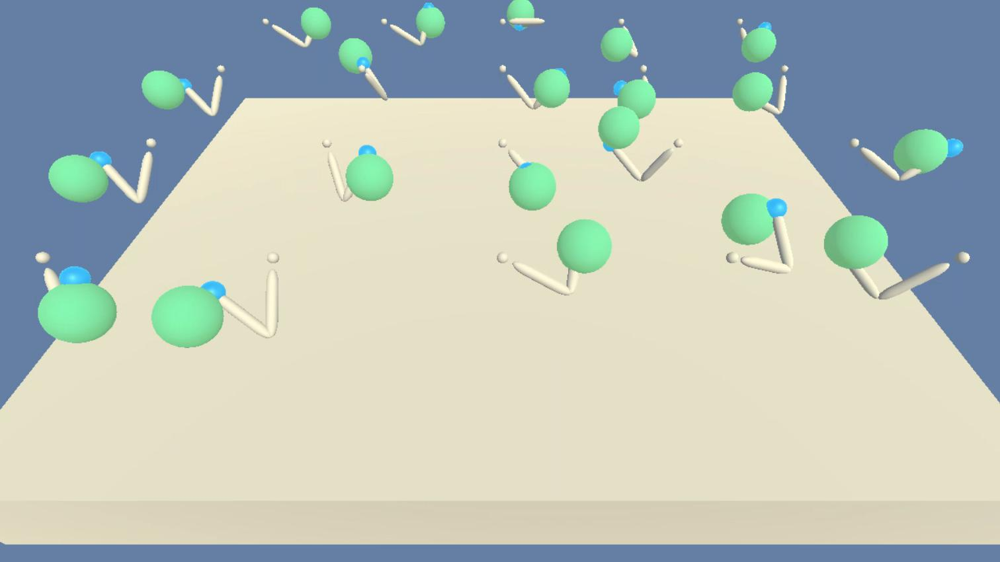

## Environment

The environment solved in this project is a variant of the  [Reacher Environment](https://github.com/Unity-Technologies/ml-agents/blob/master/docs/Learning-Environment-Examples.md#reacher) agent by Unity.




THis environment consists of 20 agents. Each agent is a double-jointed arm capable of moving around to reach different targets. The goal is for each agent to reach its hand towards a moving target (visually represented as a green dot) and stay on target for as long as possible.

The input *state-space* for the agents consists of a vector with 33 variables. This includes information such as position, rotation, velocity, and angular velocities of the arm.

Each agent is can act on the world by controlling the torque that is applied to each of the two joints. This is represented as an  *action-space* that consists of a vector of 4 continuous valued variable. Each of these action variables is a value constrained between -1 and 1.

Each agent is awarded a *reward* of +0.1 for each timestep in which the hand is on the correct target. The environment is considered solved when the agents achieve an average score of +30 (averaged over all 20 agents and across 100 consecutive episodes).


## Setup Libraries

You will need to have `Python >= 3.5` and `pip` installed, plus some aditional libraries such as:

- matplotlib
- numpy>=1.11.0
- torch==0.4.0
- unityagents

Before continuing, it is recomended that you create a new [python virtualenv](https://virtualenv.pypa.io/en/latest/) before continuing. You can install the dependencies by cloning this repository and running the following  command lines on Linux (once you are in the desired virtualenv):

```sh
# Clone repo and move into installation directory
git clone https://github.com/ronrest/rlnd_p2
cd rlnd_p2/python

# install dependencies
pip install .

# Go back to root directory of repo
cd ../
```


## Setup environment

You will need to download the environment binary files for your operating system.

- Linux: [click here](https://s3-us-west-1.amazonaws.com/udacity-drlnd/P2/Reacher/Reacher_Linux.zip)
- Linux Headless: [click here](https://s3-us-west-1.amazonaws.com/udacity-drlnd/P2/Reacher/Reacher_Linux_NoVis.zip)
    - For training on the cloud (eg Amazon AWS), or training locally without a GUI.
- Mac OSX: [click here](https://s3-us-west-1.amazonaws.com/udacity-drlnd/P2/Reacher/Reacher.app.zip)
- Windows (32-bit): [click here](https://s3-us-west-1.amazonaws.com/udacity-drlnd/P2/Reacher/Reacher_Windows_x86.zip)
- Windows (64-bit): [click here](https://s3-us-west-1.amazonaws.com/udacity-drlnd/P2/Reacher/Reacher_Windows_x86_64.zip)


If you want to train on the cloud, you can either use the Linux Headless version, or you can [enabled a virtual screen](https://github.com/Unity-Technologies/ml-agents/blob/master/docs/Training-on-Amazon-Web-Service.md)).

Make sure that you unzip the downloaded file and take note of where it is stored. The following command lines can be used in Linux for downloading the headless (No GUI) version environment and unzipping it.

```sh
# Get the headless reacher environment.
wget -c https://s3-us-west-1.amazonaws.com/udacity-drlnd/P2/Reacher/Reacher_Linux_NoVis.zip
unzip Reacher_Linux_NoVis.zip
rm Reacher_Linux_NoVis.zip
```
