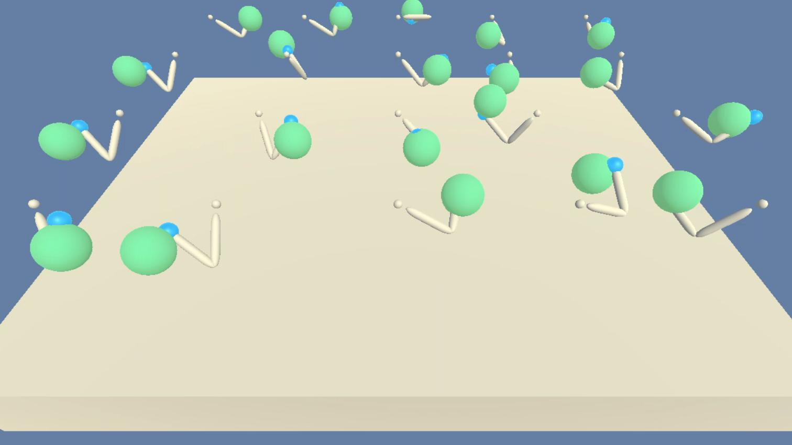

# Summary of environment and task

This project trains a Reinforcement Learning agent to solve a variant of the [Reacher Environment](https://github.com/Unity-Technologies/ml-agents/blob/master/docs/Learning-Environment-Examples.md#reacher) agent by Unity.




This environment consists of 20 agents. Each agent is a double-jointed arm capable of moving around to reach different targets. The goal is for each agent to reach its hand towards a moving target (visually represented as a green dot) and stay on target for as long as possible.

The input *state-space* for the agents consists of a vector with 33 variables. This includes information such as position, rotation, velocity, and angular velocities of the arm.

Each agent is can act on the world by controlling the torque that is applied to each of the two joints. This is represented as an  *action-space* that consists of a vector of 4 continuous valued variable. Each of these action variables is a value constrained between -1 and 1.

Each agent is awarded a *reward* of +0.1 for each timestep in which the hand is on the correct target. The environment is considered solved when the agents achieve an average score of +30 (averaged over all 20 agents and across 100 consecutive episodes).


## Learning Algorithm

Reinforcement learning algorithms using neural networks as function approximators can take one of two approaches in regards to the thing they are estimating. Firstly, given a state as input they can estimate the expected future rewards for different possible actions. This approach is known as a **value-based method**, and has seen great success and attention in the form of the Q-learning algorithm developed by [Mnih et al (2013)](https://arxiv.org/pdf/1312.5602v1.pdf), which was succesfully trained to play Atari 2600 games with super human performance. With this approach, the policy might be to chose the action that has the highest estimated value. One of the limitations of such an approach, however, is that such an approach only really works when the action space is discrete in nature (e.g. chosing one of a small number of possible actions). This approach is not particularly suiltable when you have an action space that is continuous, where any particular action can have potentially infinite possible values (e.g. accelerating a limb by a certain amount).

For tasks that involve continious actions, there is a second approach that is more suitable. You can use a function approximator to estimate the actual policy directly. For example, the output might be the actual amount that you should accelerate a limb by. This approach is known as a **policy based** method.

Policy based methods have low bias, however tend to suffer from a a variance problem. This is in contrast to value based methods which have low variance. For this reason, a hybrid approach known as **actor-critic** methods were created which combine the benefits of both value based methods and policy based methods. The idea is to use a policy based method to calculate the actions to take (actor), and a seperate value-based network (critic) that calculates the value of the actions, which are used to calculate the loss function of the actor network. The result is an agent that has low variance and low bias.

The specific actor-critc learning algorithm used in this project is the Deep Deterministic Policy Gradient (DDPG) algorithm introduced by [Lillicrap et al (2015)](https://arxiv.org/abs/1509.02971). The implementation is based on the code in [ddpg-bipedal](https://github.com/udacity/deep-reinforcement-learning/tree/master/ddpg-bipedal) code created by Udacity, but modified slightly to handle multiple simultaneous agents in the same environment.


### Psudocode

```
BUFFER_SIZE = int(1e6)  # replay buffer size
BATCH_SIZE = 1024       # minibatch size
GAMMA = 0.99            # discount factor
TAU = 1e-3              # for soft update of target parameters
LR_ACTOR = 1e-4         # learning rate of the actor
LR_CRITIC = 3e-4        # learning rate of the critic


Initialize replay buffer R to have a max size of BUFFER_SIZE
Initialize local critic network with random weights
Initialize target critic network with same weights as local critic
Initialize local actor network with random weights
Initialize target actor network with same weights as local actor

FOR episode=1 to M:
    State s_t = reset environment state
    FOR t=1 to T:
        Action a_t = output of feeding state to local actor network
        Take a step on the environment and get new state s_(t+1), reward r_t, and done
        Place the (s_t, a_t, r_t, s_(t+1), done) in replay buffer R

        IF size of replay buffer R is greater than BUFFER_SIZE:
            Randomly sample BATCH_SIZE number of experiences from R

            FOR experience in batch of experiences:
                Extract (s_t, a_t, r_t, s_(t+1), done) from experience
                Action a_(t+1)' = output of feeding state s_t to target actor network               ###### μ' and s_(t+1)
                Next Q-value q_(t+1)'  = output of feeding state s_(t+1) and action a_(t+1) to target critic network
                Target-Q-value q_(t)' = r_t + (gamma * Q_targets_next)

                Expected Q-value q_t = output of feeding current state and action s_t, a_t to local critic network
                critic loss = mean square error of Expected Q-value q_t and Target-Q-value q_(t)'
                perform gradient descent on critic network using critic loss using LR_CRITIC

                predicted_actions = local actor network
                local_reward = output of feeding state s_t, and predicted_actions to local critic
                actor_loss = -local_reward
                perform gradient descent on actor network using actor_loss using LR_ACTOR

                perform a soft update on target critic weights using TAU
                perform a soft update on target actor weights using TAU
```

The architectures used by the actor and critic network are as follows:


```
# ACTOR NETWORK
Batch Norm Layer
Fully Connected Layer(input_size=33, output_size=256)
Leaky Relu(leakiness=0.01)
Fully Connected Layer(input_size=256, output_size=128)
Leaky Relu(leakiness=0.01)
Fully Connected Layer(input_size=128, output_size=4)
Tanh Activation()


# CRITIC NETWORK
Batch Norm Layer
Fully Connected Layer(input_size=33, output_size=256)
Leaky Relu(leakiness=0.01)
Fully Connected Layer(input_size=256+33, output_size=128)
Leaky Relu(leakiness=0.01)
Fully Connected Layer(input_size=256, output_size=128)
Leaky Relu(leakiness=0.01)
Fully Connected Layer(input_size=128, output_size=1)
```

## Training

Training of the agent was performed on the [`train.ipynb`](train.ipynb) notebook.

# Results

The agent was able to solve the environment in 141 episodes with an average Score: 30.08. Below is the learning curve.


Here is a [video](https://www.youtube.com/watch?v=VqVwMerXwOk) of the trained agent acting on the environment.

# Future work

There is certainly room for improvement. To begin with, the experiences in the replay buffer are currently being sampled with equal probability. There could be better results by making use of priorotized experience replay with the existing learning algorithm.

Additionally, other learning algorithms could be used. For instance, a very recent algorithm called Distributed Distributional Deterministic Policy Gradients (D4PG) developed by [Barth-Maron et al 2018](https://openreview.net/forum?id=SyZipzbCb) has achieved state of the art results on continuous control problems. It would be interesting to see how it performs on this environment.
